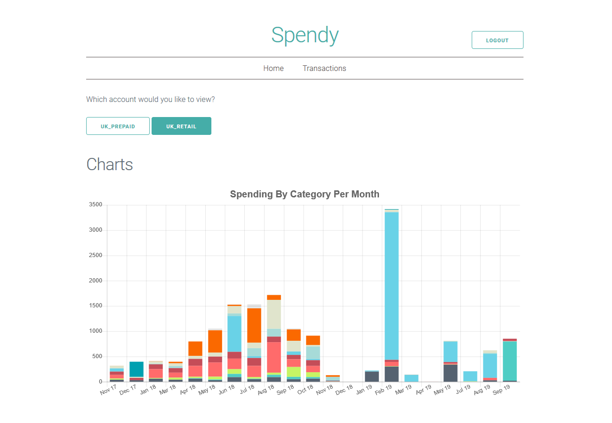

# Spendy

Web app for visualising your [Monzo](https://monzo.com/) account.

Built with React, Redux and ES6 Javascript the idea was to create an initial prototype for a dashboard to display / analyse [Monzo](https://monzo.com) transactions.

## Setup

### `npm start` or `yarn start`

Runs the app in development mode. 
Open [http://localhost:3000](http://localhost:3000) to view it in the browser.

The page will automatically reload if you make changes to the code. 
You will see the build errors and lint warnings in the console.

### `npm test` or `yarn test`

Runs the test watcher in an interactive mode. 
By default, runs tests related to files changed since the last commit.

### `npm run build` or `yarn build`

Builds the app for production to the `build` folder. 
It correctly bundles React in production mode and optimizes the build for the best performance.

The build is minified and the filenames include the hashes. 
By default, it also [includes a service worker](https://github.com/facebookincubator/create-react-app/blob/master/packages/react-scripts/template/README.md#making-a-progressive-web-app) so that your app loads from local cache on future visits.
